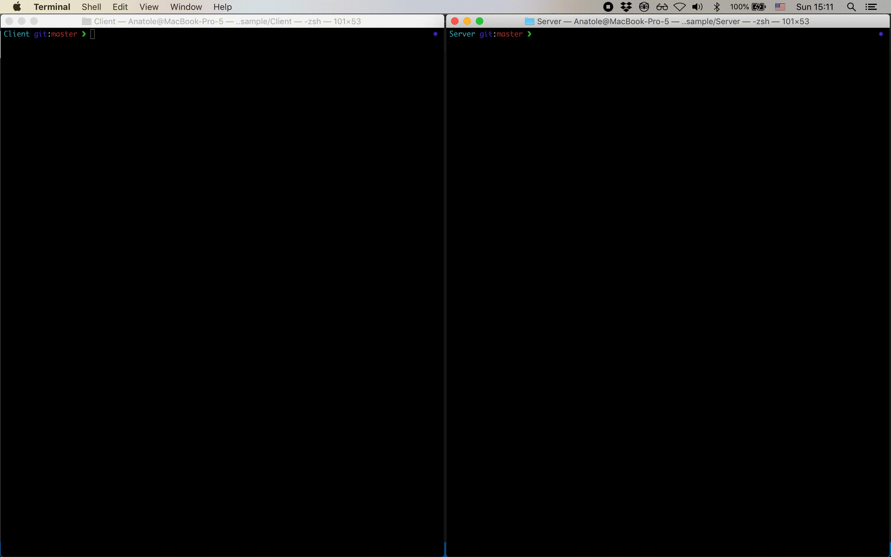
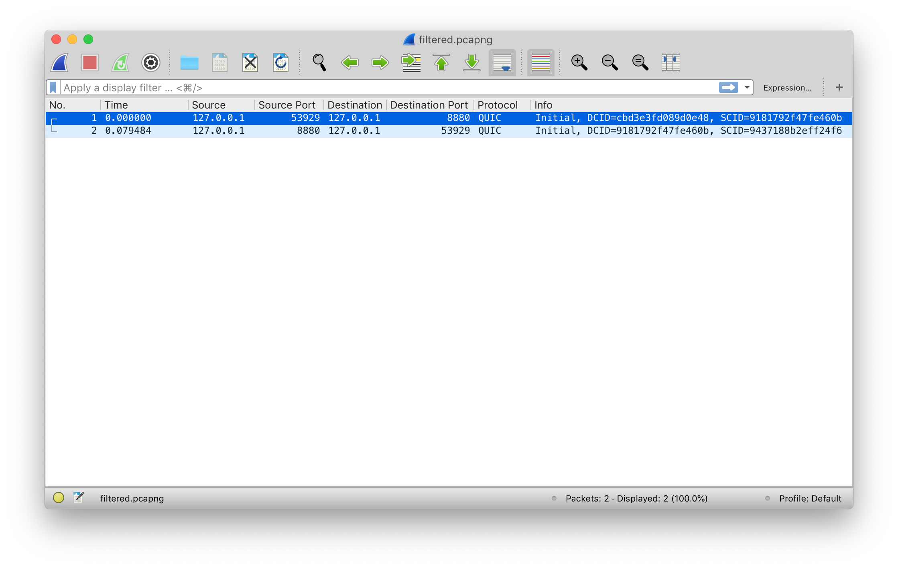
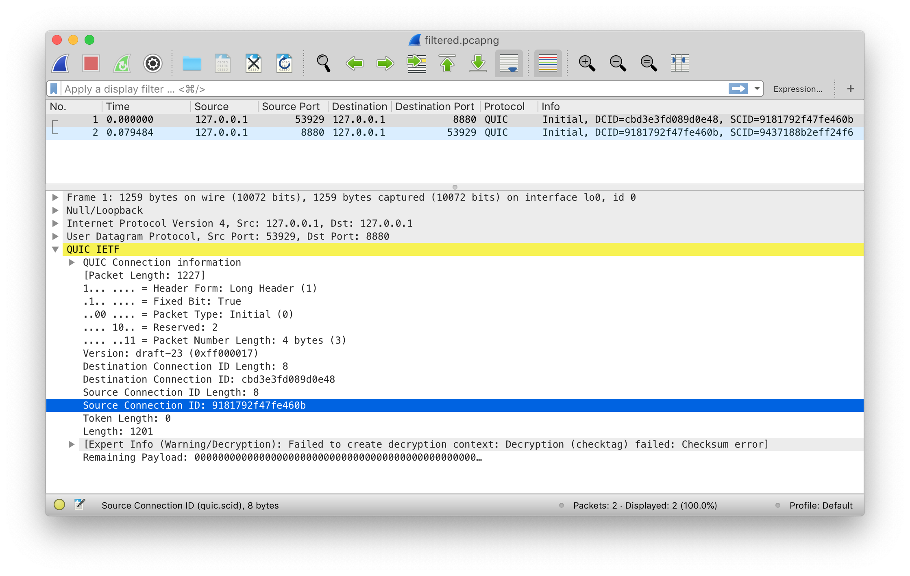
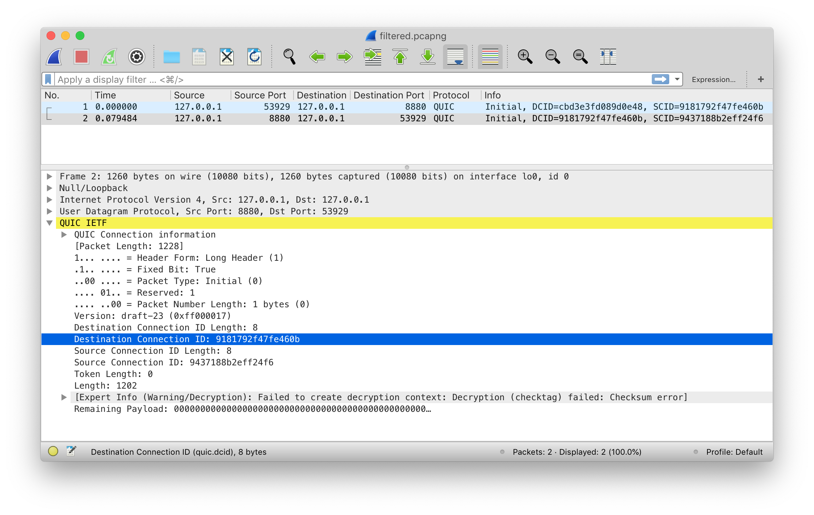
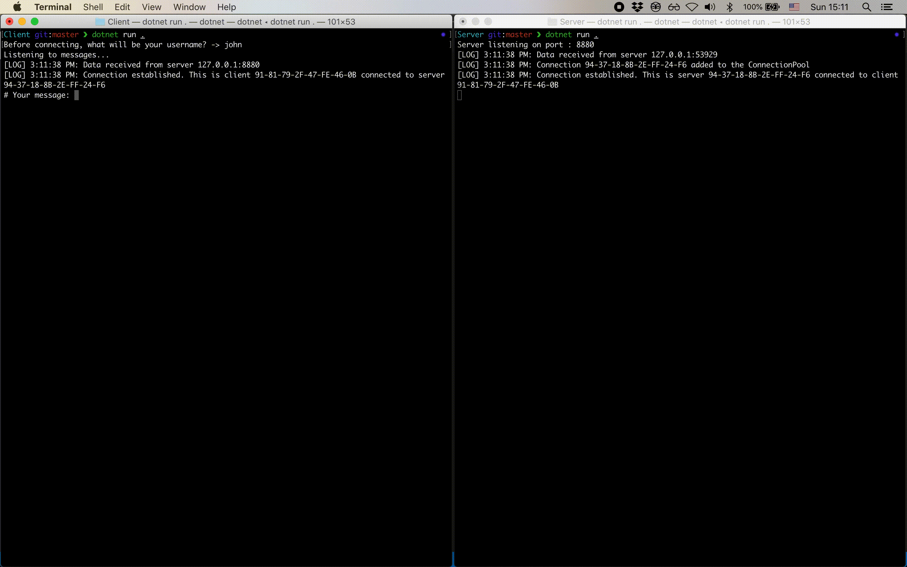
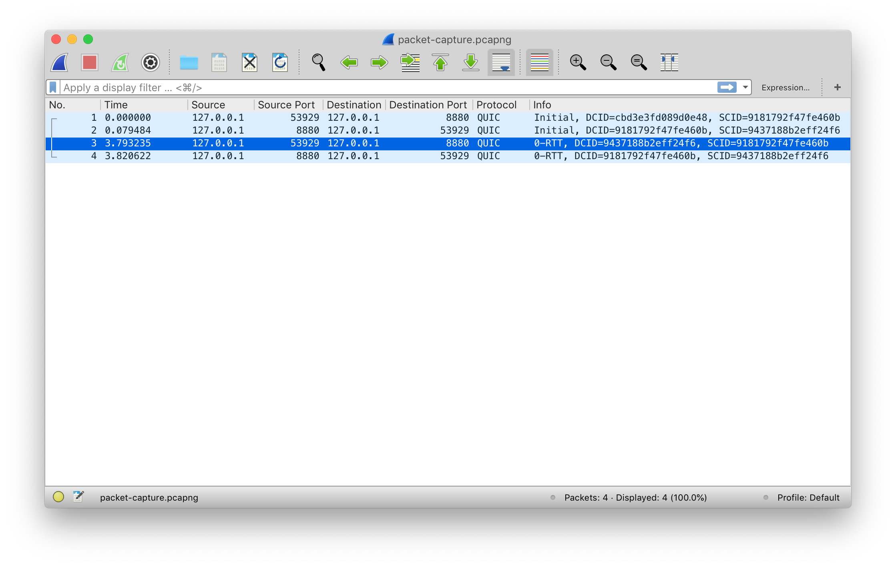
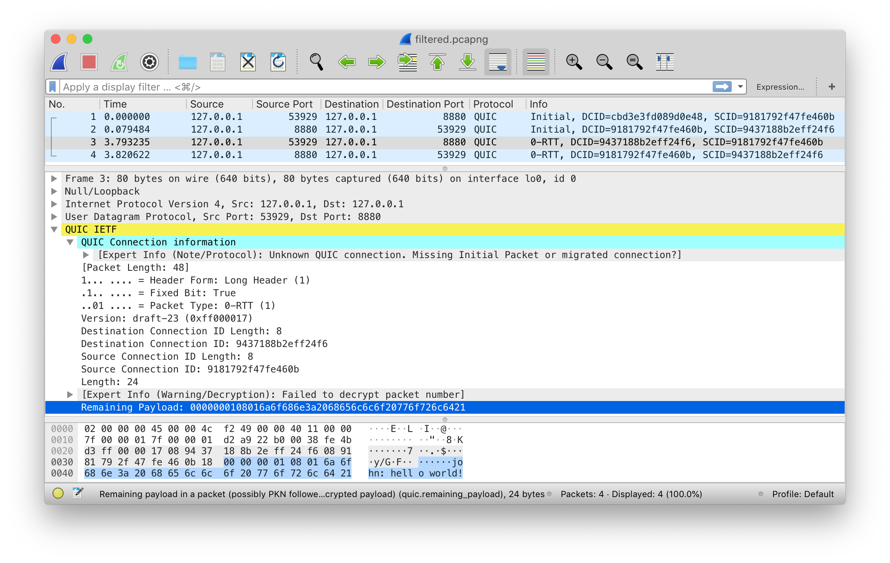
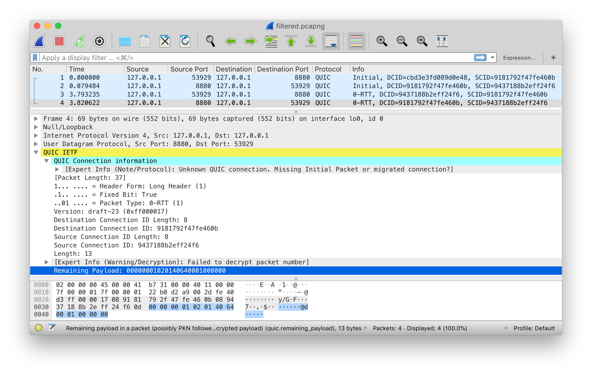
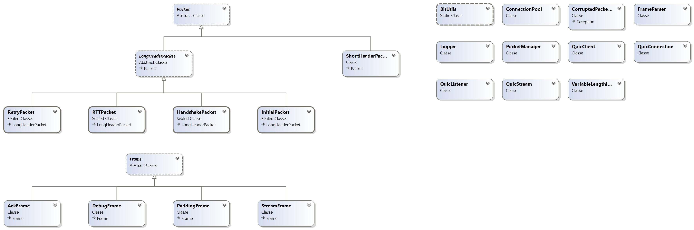

# Quicsharp

## Introduction

QUIC is a transport layer network protocol implemented on top of UDP. Amongst others, it is meant to provide lower latency and faster connection migration (e.g. when switching between cellular antennas) compared to TCP or plain UDP. As of late 2019, it is being standardized by the Internet Engineering Task Force (IETF).

**This project is a partial implementation of the [IETF QUIC Transport draft v23](https://datatracker.ietf.org/doc/draft-ietf-quic-transport/23/).**

It is an experimental project. Due to time constraints, some parts of the implementation don't perfectly match the draft. Others, like QUIC-TLS, are completely ommitted. It is not actively maintained.

## Demo

To showcase the capabilities of this C# library, we created a sample QUIC client and server (in `sample/`).

Let's launch both and have the client initiate a connection to the server:



> N.B.: after this capture was taken, `sample/Client` was updated and now sends log lines to a file (to avoid conflicts with user input in the console). Server logs are still printed in the console.

Using Wireshark, we can see that two packets were transmitted: one from the client to the server to initiate the connection, and a response from the server.



### Client -> server initial packet

It contains a suggested source and destination connection IDs (SCID and DCID). Per the doc, connection IDs are used for the consistent routing of packets:

> The primary function of a connection ID is to ensure that changes in
> addressing at lower protocol layers (UDP, IP) don’t cause packets for
> a QUIC connection to be delivered to the wrong endpoint. Each
> endpoint selects connection IDs [...] which will allow packets with
> that connection ID to be routed back to the endpoint and identified
> by the endpoint upon receipt.

> During the initial handshake, packets [...] are
> used to establish the connection ID that each endpoint uses. Each
> endpoint uses the Source Connection ID field to specify the
> connection ID that is used in the Destination Connection ID field of
> packets being sent to them. Upon receiving a packet, each endpoint
> sets the Destination Connection ID it sends to match the value of the
> Source Connection ID that they receive.

For more details, see [7.2: Negotiating connection IDs](https://tools.ietf.org/html/draft-ietf-quic-transport-23#section-7.2).

In this initial client -> server packet, the client picks a random SCID and a random DCID:



Apart from that, the packet contains a payload, consisting of one or more frames. A frame has a type (e.g. PADDING, CRYPTO, ACK) and type-dependant fields. For more details, see [12.4: Frames and Frame Types](https://tools.ietf.org/html/draft-ietf-quic-transport-23#section-12.4).

The spec requires that the Initial packet contains, in the payload, a CRYPTO frame initiating the TLS handshake. However, since we chose not to implement the cryptographic aspects of QUIC (i.e. QUIC-TLS), no CRYPTO frame is sent in our implementation. Instead, we include PADDING (`0x00`) frames. They have no semantic value and are merely to increase the size of a packet. This is to meet the minimum required (UDP datagram) size of 1200 bytes (see [14: Packet Size](https://tools.ietf.org/html/draft-ietf-quic-transport-23#section-14)) to make amplification attacks impractical.

### Server -> client initial packet

In its response, as the spec requires, the server kept the SCID provided by the client and used it as DCID.
It also picks a new, random SCID that the client will use as DCID in subsequent interactions.



Again, because we did not implement QUIC-TLS, the server's answer does not include any CRYPTO frame, only PADDING frames.

### Back to the demo

An exchange of Initial packets should be followed by Handshake packets until the TLS handshake is complete. Then, actually useful information can be exchanged between the client and the server using post-handshake packets called _short header packets_.

To be able to communicate information between the client and the server without doing a TLS handshake, we used another feature of QUIC called _0-RTT packets_. Per the spec:

> [A 0-RTT packet] is used to carry "early"
> data from the client to the server as part of the first flight, prior
> to handshake completion.

Let's see this in practice:



We can see in Wireshark that two more packets were exchanged:



First, our client sent a 0-RTT packet, using the same SCID and DCID as previously defined.

The payload contains a StreamFrame with the data entered by the user, but Wireshark cannot decode this part because we did not implement header protection, which is part of QUIC-TLS (see [5.4: Header Protection](https://tools.ietf.org/html/draft-ietf-quic-tls-23#section-5.4)). We can however see this StreamFrame in the raw bytes viewer at the bottom:



Finally, the server acknowledges the successful receipt of the packet by sending an ACK frame:



If the client had not received an acknowledgment before the end of the [ackDelay](https://github.com/quicsharp/quicsharp/blob/648a7ea093a3897d70db25fdd18dd51e8e89ab46/lib/QuicConnection.cs#L34), the client would re-send the non-acknwoledged packet.

## Usage

This project is a C# library. To show how it can be used, a sample client and server are provided in `sample/`.

### Running the sample client and sample server

Please take a look at the demo first to undestand what to expect.

Start the server in one terminal window:

```sh
cd sample/Server
dotnet run .
```

Start the client in another window:

```sh
cd sample/Client
dotnet run .
```

If you want to inspect the transmitted packets, you can install a development build of Wireshark. See _[About Wireshark](about-wireshark)_ below.

### Running unit tests

At the root of the project:

```sh
dotnet test
```

### Using the library as a server (QuicListener)

```csharp
int port = 8880;
QuicListener server = new QuicListener(port);
server.Start();
```

### Using the library as a server (QuicClient)

```csharp
QuicClient client = new QuicClient();
client.Connect("127.0.0.1", 8880);

QuicStream stream = client.CreateStream();
stream.Write()
```

## About Wireshark

Only specific versions of Wireshark are capable of inspecting QUIC draft-v23 packets.
See the [Wireshark / QUIC compatibility chart](https://github.com/quicwg/base-drafts/wiki/Tools#wireshark), then head to the [Wireshark development builds page](https://www.wireshark.org/download) to download an appropriate version.

The screenshots were made using Wireshark 3.1.1rc0-492-g179901c269a7.

A dump of the captured data that can be opened with Wireshark is available [here](media/packet-capture.pcapng).

## Class diagram



## Appendix

Command used to make the GIFs in this README (from .mov files):

```sh
ffmpeg -i in.mov -pix_fmt rgb8 -r 10 -f gif - | gifsicle --optimize=3 --delay=8 | gifsicle "#0--2" -d400 "#-1" -O2 > out.gif
```
